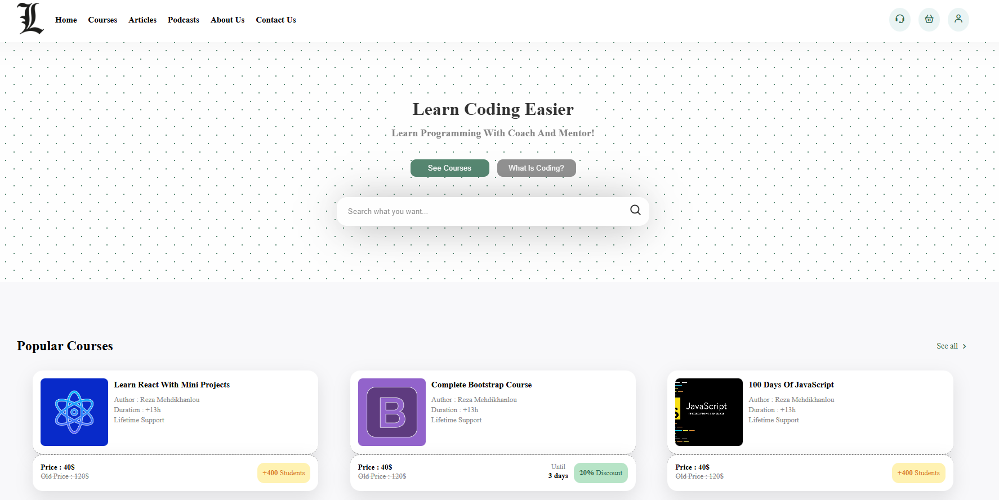

#🧾 About the Project: site_cursos_prog
## This project represents a prototype website for programming courses, developed using only basic HTML and CSS. The website was created with a focus on visual design and content structure, being non-functional — meaning it lacks interactive features or backend integration.

## It uses illustrative images and visual elements to simulate the environment of an educational platform. The layout features typical sections such as a navigation menu, course highlights, descriptions, and decorative buttons, all styled with simple CSS and utilizing static assets.

### The main objective is to demonstrate the design and organization of an institutional course website, making it ideal for study purposes, portfolios, and practice with HTML markup and visual styling.

